# Garment Manufacturing CRM — Requirements and Process Flow

## 1. Purpose

This CRM is intended for a garment manufacturer serving two major business models:

1. **Uniform programs** for companies, schools, hospitals, hotels, security agencies, industrial clients, government departments, and other institutions.
2. **Buying houses and fashion/lifestyle brands**, where the manufacturer manages seasonal developments, samples, quotations, purchase orders, production, inspections, and shipments.

The CRM should provide one customer-facing system from lead generation through repeat business, while exchanging production, inventory, purchasing, and accounting data with an ERP/MRP system.

> **Recommended boundary:** The CRM should own customers, communications, opportunities, developments, approvals, quotations, orders, service issues, and customer-visible milestones. Detailed inventory, procurement, line planning, payroll, and shop-floor execution should remain in ERP/MRP/MES systems.

### Companion documents

- [CRM Application — Tab-wise Navigation and Screen Structure](./connected-lifecycle.md)
- [CRM Implementation Step 01 — Customer Accounts, Hierarchy, Contacts, and Activities](../tasks/current-task.md)

---

## 2. Overall Process Flow

```mermaid
flowchart LR
    A[Lead or Tender] --> B[Customer Qualification]
    B --> C[Requirement or Tech Pack]
    C --> D[Product Development and Sampling]
    D --> E[Costing and Quotation]
    E --> F[Negotiation and Approval]
    F --> G[Contract or Purchase Order]
    G --> H[Pre-production Approvals]
    H --> I[Production Visibility]
    I --> J[Quality Inspection]
    J --> K[Dispatch or Shipment]
    K --> L[Invoice and Payment]
    L --> M[Claims, Feedback, Renewal or Reorder]
    M --> C
```

The system should branch into a **Uniform Program Flow** or a **Buying House/Brand Flow** after qualification, while sharing customer, costing, order, production milestone, shipment, finance, and complaint records.

---

## 3. Customer and Account Structure

The CRM must support complex account relationships rather than treating every customer as a single company.

### Common customer information

- Legal entity, trading name, tax details, addresses, country, currency, language, and time zone
- Customer type: uniform client, brand, buying house, retailer, distributor, agent, government body, or institutional customer
- Parent company and subsidiary relationships
- Contacts, roles, departments, decision-makers, approvers, and influencers
- Product categories and expected annual volumes
- Pricing tier, payment terms, credit limit, Incoterms, and preferred shipping methods
- Compliance, testing, sustainability, and certification requirements
- Assigned salesperson, merchandiser, account manager, and service team
- Communication history, meeting notes, attachments, tasks, and next actions

### Buying house and brand relationships

The system should separately record:

- Buying house
- End buyer or brand
- Retailer, importer, or licensee
- Agent and commission arrangement
- Nominated factory, fabric mill, trim supplier, testing lab, inspector, and freight forwarder
- Billing party, approving party, PO issuer, consignee, and delivery destination

A single development or order may involve several of these parties. Communications and approvals should show exactly who made each decision.

### Uniform account relationships

The system should support:

- Head office and multiple branches, schools, campuses, hotels, hospitals, plants, or project sites
- Departments, job roles, grades, houses, teams, or employee categories
- Centralized versus location-level ordering
- Contract owner, procurement contact, HR/admin contact, wearer coordinator, and accounts contact
- Approved garment entitlement by role or wearer category

---

## 4. Lead, Tender, and Opportunity Management

### Information to capture

- Lead source and campaign
- Customer segment and estimated annual value
- Requested garment categories
- Estimated quantities, target prices, and delivery expectations
- Tender/RFQ number, submission deadline, validity, security deposit, and required documents
- Competitors and current supplier, where known
- Probability, expected close date, next action, and lost reason

### Suggested pipeline

`New Lead → Contacted → Qualified → Requirement Received → Development/RFQ → Quotation → Negotiation/Trial → Won or Lost`

For uniform contracts, add optional stages:

`Tender Identified → Eligibility Review → Tender Submitted → Technical Evaluation → Sample/Trial → Commercial Evaluation → Contract Awarded`

---

## 5. Requirement and Product Development

Each opportunity can contain multiple **styles**. Every style should maintain version-controlled specifications.

### Style information

- Customer style number and internal style number
- Garment category, gender/unisex classification, season, collection, and end use
- Tech pack, drawings, reference images, construction details, and bill of materials
- Fabric composition, weave/knit, GSM, finish, color, and approved mill
- Trims, labels, badges, logos, embroidery, printing, reflective tape, and packaging
- Measurement specification and tolerance
- Size range, colorways, quantities, and destination breakdown
- Target price, required sample date, ex-factory date, and delivery date
- Testing, safety, sustainability, and social-compliance requirements
- Revision history with author, date, reason, and approval status

### Uniform-specific requirements

- Client, department, job role, location, and wearer category
- Logo placement, embroidered/printed name, employee ID, rank, house, or department
- Standard sizes, made-to-measure sizes, and alteration rules
- Male, female, maternity, adaptive, religious, climate, and seasonal variants where required
- Per-person entitlement, issue frequency, replacement policy, and joining/leaving rules
- Safety requirements such as high visibility, flame resistance, antistatic properties, food safety, cleanroom use, or chemical resistance
- Fabric shade continuity and long-term repeatability
- Approved design period and contract validity
- Sample wearer trial and size-set approval

Personal wearer measurements and employee identifiers must have restricted access, retention rules, and an audit trail.

---

## 6. Sampling and Approvals

### Sample types

- Proto sample
- Fit sample
- Size-set sample
- Salesman or showroom sample
- Photo sample
- Wash sample
- Pre-production sample
- Shipment sample
- Uniform wearer-trial sample
- Tender or sealed-reference sample

### Sample workflow

`Requested → Materials Ready → Pattern/CAD → Cutting → Stitching → Internal Review → Dispatched → Customer Review → Approved or Revision Required`

Each sample record should include:

- Style, version, sample type, size, color, and quantity
- Requested, planned, completion, and dispatch dates
- Responsible merchandiser and sample-room owner
- Fabric, trim, artwork, pattern, and measurement status
- Courier details and tracking number
- Customer comments, annotated files, approval decision, and decision date
- Rejection/revision reason and next action
- Photos and physical sample location

Previous versions and comments must never be overwritten.

---

## 7. Costing and Quotation

### Cost components

- Fabric consumption, price, process loss, and wastage
- Trims and accessories
- Cutting, making, finishing, and packing
- Washing, dyeing, printing, embroidery, and special processes
- Testing, certification, and inspection
- Packaging, freight, duties, and logistics
- Buying-house or agent commission
- Overheads, financing cost, and margin
- Currency and exchange-rate assumptions
- MOQ and quantity-based price breaks

### Required controls

- Multiple costing versions with comparison
- Customer target price versus calculated price
- FOB, CIF, ex-works, landed, CMT/CM, and delivered-price options
- Internal margin approvals and role-based margin visibility
- Quotation validity and commercial assumptions
- Approval before sending prices below a configured margin
- Estimated-versus-actual costing after completion

### Uniform pricing additions

- Contract price list by garment, size band, customization, and location
- One-time development, pattern, digitization, or tooling charges
- Made-to-measure and alteration charges
- Emergency/replacement order surcharge
- Price escalation clauses based on fabric, labor, or contract anniversary

### Flow

`Costing Prepared → Merchandising Review → Commercial Approval → Quote Submitted → Negotiation → Revision → Customer Acceptance`

---

## 8. Contracts, Purchase Orders, and Reorders

### Common order information

- Customer PO and internal order number
- Contract, quotation, opportunity, and style references
- Style-color-size quantities
- Price, currency, tax, payment terms, and Incoterms
- Delivery windows and ship-to locations
- Quantity tolerances and packing instructions
- Test, inspection, compliance, and documentation requirements
- Revision and amendment history

Any change to price, quantity, specification, or delivery date should create a controlled amendment with an approval trail.

### Buying house/brand orders

- Brand and buying-house references
- Season, collection, drop, launch date, and critical path
- Destination-wise and PO-wise quantity breakdown
- Vendor/factory allocation
- Buyer manual, packaging manual, and nominated supplier rules
- Commission and chargeback terms

### Uniform contracts and call-off orders

- Contract start/end dates and renewal notice date
- Agreed annual quantity or minimum commitment
- Approved catalog and price list
- Department/location budgets
- Wearer entitlement and remaining balance
- Bulk initial issue, scheduled issue, and ad hoc replacement orders
- Location-level call-off order and approval workflow
- Stock-supported versus made-to-order garments
- Contract consumption and remaining commitment

Uniform repeat orders should be creatable from the approved catalog without repeating the complete development process, unless a specification or branding change is requested.

---

## 9. Uniform Sizing, Allocation, and Issuance

This should be a dedicated module or closely linked subsystem.

### Capabilities

- Import wearer lists securely
- Schedule sizing camps by site and date
- Record standard size or measurements
- Recommend a standard size using configured rules
- Record fitting comments and alteration requirements
- Allocate garments by wearer, role, department, and location
- Generate packing lists by wearer, department, or site
- Track issue, acknowledgement, exchange, alteration, return, and replacement
- Maintain a wearer history without exposing it to unauthorized users
- Support employee joining, transfer, promotion, and exit

### Uniform fulfillment flow

```mermaid
flowchart LR
    A[Contract and Catalog Approved] --> B[Wearer or Location Requirement]
    B --> C[Sizing or Size Confirmation]
    C --> D[Entitlement and Budget Approval]
    D --> E[Stock Allocation or Production Order]
    E --> F[Customization]
    F --> G[Quality Check]
    G --> H[Pack by Wearer or Location]
    H --> I[Delivery and Acknowledgement]
    I --> J[Alteration, Exchange, or Replacement]
```

---

## 10. Pre-production and Time-and-Action Calendar

Generate a time-and-action calendar automatically when an order is confirmed.

Typical milestones include:

- PO/contract confirmation
- Fabric and trim booking
- Lab dip, strike-off, artwork, badge, and embroidery approval
- Fit, size-set, wash, and pre-production sample approval
- Fabric and garment testing
- Packaging approval
- Size/wearer data freeze for uniform orders
- Production planning confirmation
- Pre-production meeting
- Inspection booking
- Ex-factory and shipment dates

Every milestone requires an owner, planned date, actual date, dependency, status, evidence, and escalation rule.

Production should not start while mandatory approvals are incomplete unless an authorized user records an exception and reason.

---

## 11. Production Visibility and Risk Management

The CRM should receive customer-relevant milestones from the ERP/MRP/MES:

- Raw material readiness
- Fabric inspection
- Cutting
- Printing or embroidery
- Sewing
- Washing or finishing
- Packing
- Final inspection
- Ready-to-dispatch quantity
- Ex-factory readiness

Each order should show:

- Overall status: **On Track, At Risk, Delayed, or Blocked**
- Planned versus actual milestone dates
- Current risk and reason
- Responsible owner
- Recovery action
- Forecast completion and delivery impact
- Quantity completed, rejected, packed, and ready to ship

For uniform programs, show progress by location, wearer batch, garment type, and customization batch. For brand orders, show progress by PO, style, color, size, factory, and destination.

---

## 12. Quality, Compliance, and Inspection

Track:

- Fabric inspection and shade lots
- Inline, end-line, and final inspections
- AQL level and inspection standard
- Defect categories, severity, and quantities
- Pass, fail, pending, or conditional-pass result
- Root cause and corrective/preventive action
- Reinspection and closure
- Third-party inspection agency
- Test reports, certificates, and expiry dates
- Customer-specific compliance requirements

Uniform-specific controls may include reflective performance, flame resistance, colorfastness, industrial wash durability, badge/branding accuracy, wearer comfort, and size consistency.

All defects and claims should be traceable to the customer, order, style, color, size, fabric lot, supplier, factory, line, and shipment where data is available.

---

## 13. Dispatch, Shipment, and Documentation

### Capabilities

- Shipment plan, partial shipments, and balance quantities
- Customer/location/destination allocation
- Booking status, forwarder, mode, vessel/flight, ETD, ETA, and tracking
- Carton, pallet, packing, and assortment details
- Commercial invoice and packing list
- Bill of lading or airway bill
- Certificate of origin, inspection report, and test certificates
- Actual ex-factory, dispatch, and delivery dates
- Proof of delivery and recipient acknowledgement
- Customer notification when milestones change

Uniform deliveries should support wearer-wise, department-wise, and site-wise packing. Brand shipments should support destination, ratio-pack, solid-pack, carton-marking, and retailer-routing requirements.

---

## 14. Invoice, Payment, and Credit Control

- Proforma and commercial invoices
- Advance, letter of credit, documentary collection, and open-account terms
- Due dates, receipts, outstanding amounts, and ageing
- Credit limit and account-hold status
- Deductions, debit notes, chargebacks, penalties, and credit notes
- Agent/buying-house commissions
- Contract deposits, retention, and tender securities where applicable
- Finance notes with restricted access

---

## 15. Complaints, Claims, Alterations, and Service

### Complaint record

- Customer, order, style, wearer/location, and shipment
- Complaint category and severity
- Defect quantity, photographs, and supporting evidence
- Customer-requested resolution
- Root cause and responsible department
- Corrective and preventive action
- Replacement, repair, alteration, credit note, or rejection decision
- Cost of quality and final closure date

### Flow

`Received → Validated → Investigated → Resolution Approved → Customer Informed → Corrective Action Verified → Closed`

For uniforms, include alteration, size exchange, missing item, incorrect personalization, new joiner, emergency replacement, and normal wear-and-tear categories.

---

## 16. Renewals, Reorders, and Account Growth

### Brand/buying-house growth

- Seasonal calendar and development reminders
- Carry-forward styles, blocks, fabrics, trims, and approvals
- Reorder creation using approved specifications
- Previous versus current cost comparison
- Dormant-account alerts and category cross-selling

### Uniform-program growth

- Contract renewal and price-review alerts
- Consumption versus contracted quantity
- Forecast by hiring plan, attrition, location, and issue cycle
- Automatic replenishment suggestions
- New-location and new-role opportunities
- Wearer satisfaction and service-level reviews

---

## 17. Dashboards and KPIs

### Sales and account management

- Pipeline value by customer type, owner, and stage
- Tender/RFQ win rate
- Inquiry-to-order conversion
- Expected versus confirmed order value
- Customer profitability and lifetime value
- Repeat-order and contract-renewal rate
- Lost-opportunity reasons

### Development and merchandising

- Sample turnaround time and approval rate
- Number of sample revisions
- Quotation response time
- Approval delays by customer and milestone
- Merchandiser workload

### Delivery and quality

- Orders on track, at risk, delayed, and blocked
- On-time sample, ex-factory, shipment, and delivery percentages
- First-pass inspection rate
- Defect, alteration, return, and claim rates
- Claim cost and closure time

### Uniform program

- Contract consumption and remaining commitment
- Wearers sized, pending, allocated, delivered, and acknowledged
- Fulfillment by location and garment type
- Size exchange and alteration rate
- Stock coverage and replenishment forecast

### Finance

- Order value, estimated margin, and actual margin
- Receivables ageing and overdue accounts
- Deductions, chargebacks, credit notes, and commissions

---

## 18. Roles and Permissions

Recommended roles include:

- Sales/business development
- Key account manager
- Merchandiser
- Uniform program coordinator
- Product development and sampling
- Costing/commercial
- Pattern/CAD and technical team
- Production planner
- Quality and compliance
- Warehouse and dispatch
- Logistics/export documentation
- Finance and credit control
- Management
- Customer/buyer portal user
- Location administrator or wearer coordinator

Use role-, record-, and field-level permissions. Internal margins, supplier prices, credit information, commissions, wearer details, and personal measurements should only be visible to authorized users.

---

## 19. Customer Portals

### Buying house/brand portal

- Submit inquiries, tech packs, and revisions
- Review samples, quotations, and approval requests
- View critical-path and order status
- Download shipment and compliance documents
- Raise claims and view resolutions

### Uniform client portal

- Browse the approved uniform catalog and contract prices
- Submit wearer/location orders within entitlement and budget
- Upload or maintain wearer lists based on permission
- Schedule sizing or submit sizes
- Track production, delivery, exchanges, and replacements
- Approve proofs for logos, badges, names, and personalization
- View contract usage and service performance

---

## 20. Automations

- Reminders for inactive leads, renewals, and tender deadlines
- Alerts for overdue samples, approvals, and buyer comments
- Margin approval when price falls below a threshold
- Automatic time-and-action calendar after PO confirmation
- Escalation when a critical milestone slips
- Sample dispatch, order-risk, shipment, and delivery notifications
- Payment-due and credit-limit alerts
- Duplicate style, customer PO, and wearer-record checks
- Risk score based on material, approval, production, inspection, and logistics delays
- Uniform entitlement validation and replenishment reminders
- Size-data freeze reminders before production
- Alerts for expiring certificates, contracts, price lists, and test reports

---

## 21. Integrations

- **ERP/MRP:** item master, BOM, procurement, inventory, production orders, WIP, and actual costs
- **Accounting:** invoices, receipts, credit limits, ageing, taxes, and credit notes
- **PLM:** tech packs, specifications, materials, and product versions
- **CAD/marker systems:** patterns, measurements, and marker references where needed
- **Email/calendar:** communications, meetings, deadlines, and follow-ups
- **Courier/freight systems:** tracking, ETD, ETA, and proof of delivery
- **Testing/inspection providers:** reports, results, and certificates
- **Customer portals or EDI:** purchase orders, forecasts, ASNs, invoices, and order status
- **Barcode/RFID:** uniform allocation, packing, issuance, exchanges, and returns

All integrations should use stable internal IDs, timestamps, source-system references, and error/retry logs.

---

## 22. Recommended First Release

### Phase 1 — Commercial and development foundation

1. Customer, hierarchy, contact, and activity management
2. Lead, tender, opportunity, and RFQ pipeline
3. Style, tech pack, specification, and attachment versions
4. Sample and approval tracking
5. Costing, quotation, and internal approvals
6. PO/contract conversion and amendments
7. Time-and-action calendar, alerts, and dashboards

### Phase 2 — Fulfillment and service

1. ERP production-milestone integration
2. Quality, inspection, shipment, and documentation
3. Complaints, claims, alterations, and replacements
4. Invoice, payment, and credit visibility
5. Buying-house/brand customer portal

### Phase 3 — Uniform program capabilities

1. Approved catalog, contract price list, and entitlements
2. Wearer/location requirements and secure sizing records
3. Sizing camps, allocations, personalization, and wearer-wise packing
4. Issue, acknowledgement, exchange, alteration, and replacement workflows
5. Replenishment forecasting and uniform client portal

---

## 23. Key Design Principles

1. Model the **customer, buying house, brand, billing party, and delivery party separately**.
2. Make the **style** the central product-development record and preserve every revision.
3. Treat **approvals and dates as structured records**, not only email attachments.
4. Support both **seasonal fashion orders** and **long-running uniform contracts**.
5. Allow uniform orders by **wearer, department, location, entitlement, and issue cycle**.
6. Protect personal sizing and employee data with strict permissions and retention controls.
7. Provide one reliable view of commitments, risks, approvals, delivery, quality, and payment.
8. Integrate with manufacturing systems instead of duplicating detailed factory execution in the CRM.
