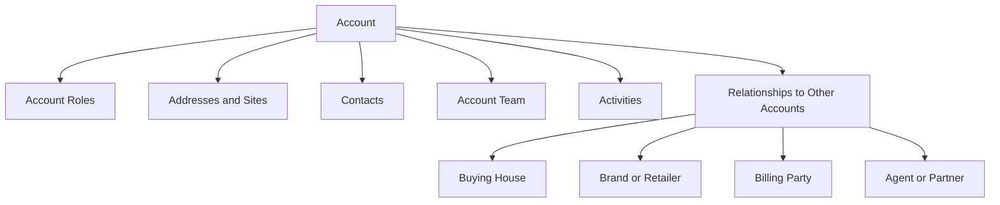

> **Status:** Active
>
> **Current phase:** Step 01
>
> **Implementation repositories:**
>
> - `/Users/risheeray/grav-cms-backend`
> - `/Users/risheeray/grav-cms`
>
> **Instruction:** Implement and verify only Step 01. Do not begin Step 02.
# CRM Implementation Step 01 — Customer Accounts, Hierarchy, Contacts, and Activities

**Parent specification:** [Garment Manufacturing CRM — Requirements and Process Flow](../product/crm-master-requirements.md)  
**Implementation order:** Step 01 of the CRM build  
**Scope:** Customer master foundation only  
**Next connected step:** Lead, Tender, Opportunity, and RFQ Pipeline

---

## 1. Instructions for the Implementing Agent

Implement this step inside the existing application using its current architecture, UI system, authentication, database conventions, validation approach, and test framework.

Before changing code:

1. Inspect the repository structure and identify the application stack.
2. Identify existing authentication, organization/tenant, user, role, database, API, component, and testing patterns.
3. Reuse existing shared components and conventions.
4. Check for uncommitted work and preserve unrelated changes.
5. Record assumptions when the existing application does not answer a design question.

Do not implement leads, tenders, opportunities, styles, samples, costing, quotations, orders, production, shipments, invoices, or claims in this step. Create only the stable customer foundation and clearly defined connection points those modules will use later.

This step must, however, establish the **connected lifecycle shell** described in `garment-crm-tab-wise-navigation.md`: a persistent customer/journey header and the sequential `Account → Enquiry → Develop → Price → Confirm → Fulfil → Deliver → Grow` page bar. Only Account is functional in Step 01. Future lifecycle pages should be visibly unavailable or marked as requiring an Enquiry; do not create empty fake modules or implement their business logic.

At completion, report:

- What was implemented
- Database changes
- New screens and routes
- APIs or server actions added
- Permissions added
- Tests run and their results
- Assumptions or known limitations
- Any setup or migration command the user must run

---

## 2. Objective

Create a reliable customer master that can represent both:

1. **Uniform customers** with a head office, branches, campuses, hospitals, hotels, factories, project sites, departments, and wearer coordinators.
2. **Buying-house/brand business** where the buying house, end brand, retailer, importer, billing party, approving party, consignee, agent, and factory may be different organizations.

Users must be able to create organizations, connect them through typed relationships, maintain contacts and addresses, assign internal owners, record activities, search the customer base, and preserve an audit history.

This step becomes the shared foundation for all later CRM records.

---

## 3. Completion Outcome

When this step is complete, an authorized user can:

1. Create a customer or related business organization.
2. Classify the organization by one or more business roles.
3. Add its legal, commercial, tax, and communication details.
4. Create branches, locations, departments, and external organizational relationships.
5. Add contacts and identify decision-makers, approvers, coordinators, and accounts contacts.
6. Maintain billing, shipping, registered, office, and site addresses.
7. Assign a salesperson, account manager, merchandiser, and service owner.
8. Add notes, calls, emails, meetings, tasks, and file references.
9. View all of this on one customer detail page.
10. Search, filter, archive, restore, and detect likely duplicates.
11. See who created or changed important customer data.
12. Understand that Account is the first page of one connected sales lifecycle and see the future stage sequence without navigating through unrelated modules.

---

## 4. Scope

### 4.1 Included

- Organization/customer accounts
- Customer and partner classifications
- Parent-child organizational hierarchy
- Typed relationships between separate organizations
- Departments or business units
- Addresses and delivery locations
- Contacts and contact roles
- Internal account ownership/team assignments
- Customer preferences and commercial profile
- Activity timeline
- Notes, tasks, and attachment metadata
- Search, filters, pagination, and duplicate warnings
- Archive and restore
- Permissions and audit history
- Minimal summary dashboard for customer records
- Extension fields required by future CRM modules

### 4.2 Excluded

- Lead capture and qualification
- Tenders, opportunities, and RFQs
- Tech packs, styles, products, and samples
- Costing and quotations
- Contracts and purchase orders
- Uniform wearer measurements and entitlements
- Production, quality, shipment, invoicing, and claims
- Sending real emails or calendar invitations unless the application already has that integration
- Detailed ERP customer synchronization unless an ERP interface already exists

The excluded modules will reference the identifiers created here; they should not be partially implemented now.

---

## 5. Terminology

| Term | Meaning |
|---|---|
| Account | Any organization participating in the commercial process |
| Customer | An account that purchases, contracts, or places business |
| Buying house | An intermediary coordinating sourcing for one or more brands/buyers |
| Brand | The end brand whose product is being developed or manufactured |
| Uniform client | An institution operating an ongoing uniform program |
| Site/location | A branch, campus, hotel, hospital, factory, warehouse, or delivery point |
| Department | A unit within an account or site, such as housekeeping, security, or procurement |
| Contact | A person associated with an account, site, or department |
| Account relationship | A typed connection between two accounts |
| Internal account team | Employees responsible for selling, merchandising, service, or finance |
| Activity | A call, email, meeting, task, note, or other interaction |

Use **Account** as the core technical concept even if the UI labels a record as Customer, Brand, Buying House, Site, or Partner.

---

## 6. Core Design Principle

Do not store the buying house, brand, bill-to party, or ship-to party as free-text fields on future orders. Store each as an Account and connect them using IDs.



An account can have multiple roles. For example, a company may be both a brand and a direct customer. Do not force it into one mutually exclusive type.

---

## 7. Data Model

Adapt names and types to the existing stack, but preserve the behavior below. Every tenant-owned table must include the application's normal tenant/organization boundary.

### 7.1 Account

Required fields:

| Field | Requirement |
|---|---|
| `id` | Stable UUID or application-standard identifier |
| `accountCode` | Human-readable unique code, generated automatically unless manually permitted |
| `displayName` | Required customer-facing name |
| `legalName` | Legal entity name |
| `status` | Prospect, Active, On Hold, Dormant, Archived |
| `lifecycleStage` | Target, Prospect, Development, Customer, Former Customer, Partner |
| `parentAccountId` | Optional hierarchy parent within the same tenant |
| `website` | Valid URL when provided |
| `primaryEmail` | General business email |
| `primaryPhone` | General business phone with country code support |
| `countryCode` | ISO country code |
| `defaultCurrency` | ISO currency code |
| `language` | Preferred communication language |
| `timeZone` | IANA time-zone identifier |
| `taxRegistrationNumber` | Optional and permission-protected if required locally |
| `registrationNumber` | Optional legal/company registration number |
| `paymentTermsCode` | Text/code placeholder for future finance integration |
| `creditStatus` | Not Checked, Approved, Review Required, On Hold |
| `creditLimit` | Optional decimal; restricted to authorized roles |
| `defaultIncoterm` | Optional valid Incoterm code |
| `annualVolumeEstimate` | Optional unit estimate |
| `annualRevenueEstimate` | Optional money value and currency |
| `customerTier` | Strategic, Key, Standard, Trial, or configurable equivalent |
| `notesSummary` | Short non-sensitive summary only |
| `sourceSystem` | CRM, ERP, Import, or configured integration source |
| `externalReference` | Optional ERP/legacy customer ID |
| `createdBy`, `updatedBy` | User references |
| `createdAt`, `updatedAt` | Timestamps |
| `archivedAt`, `archivedBy` | Nullable soft-archive information |

Rules:

- `displayName` is required and trimmed.
- Account codes are unique within a tenant.
- `parentAccountId` cannot point to the same record or create a hierarchy cycle.
- Archived accounts remain readable in history but cannot be selected for new transactions by default.
- Currency, country, time zone, and Incoterm values must be validated.
- External references should be unique per source system when populated.
- Do not hard-delete accounts from the normal UI.

### 7.2 Account Role

Use a many-to-many model so one account can have multiple roles.

Initial role values:

- Uniform Client
- Direct Brand
- Buying House
- Retailer
- Importer
- Distributor
- Government/Institution
- School/Education
- Hotel/Hospitality
- Hospital/Healthcare
- Industrial/Corporate
- Agent
- Factory
- Fabric Mill
- Trim Supplier
- Testing Laboratory
- Inspection Agency
- Freight Forwarder
- Other Partner

Store configurable role IDs or codes, not display text in transactional records.

### 7.2A Garment Sales Profile

The Account detail page must include a **Garment Sales Profile**. These are stable customer-level preferences and commercial indicators used by sales and merchandising. They are not a replacement for opportunity quantities, style specifications, quotations, contracts, or wearer records.

Use controlled, configurable multi-select lookups where appropriate.

#### Business and product profile

- `businessModels[]`: Uniforms, Export Brand, Domestic Brand, Buying House, Private Label, Full Package/FOB, CMT/CM, or configurable equivalent
- `productCategories[]`: shirts, trousers, jackets, knitwear, denim, workwear, schoolwear, healthcare uniforms, hospitality uniforms, PPE, and configurable additions
- `constructionTypes[]`: woven, knit, denim, sweater, outerwear, or configurable additions
- `wearerOrConsumerCategories[]`: menswear, womenswear, kidswear, unisex, occupational, or configurable additions
- `targetMarkets[]`: countries or commercial regions served by the customer
- `estimatedAnnualPieces`
- `estimatedAnnualStyles`
- `typicalOrderQuantityMin` and `typicalOrderQuantityMax`
- `expectedMOQ`
- `targetPriceBandMin`, `targetPriceBandMax`, and `targetPriceCurrency`
- `expectedDevelopmentLeadDays`
- `expectedBulkLeadDays`
- `orderFrequency`: seasonal, monthly, quarterly, annual, call-off, ad hoc, or configurable equivalent
- `peakSeasons[]`
- `buyingCalendarNotes`
- `customerPotential`: Strategic, High, Medium, Low, Trial, or configurable equivalent

These values are account-level indicators only. Exact quantity, target price, season, delivery date, and product requirements belong to an Opportunity/RFQ or Development.

#### Compliance and quality profile

- `requiredCertifications[]`
- `socialComplianceRequirements[]`
- `sustainabilityRequirements[]`
- `restrictedSubstanceRequirements[]`
- `defaultTestingProtocol`
- `defaultInspectionStandard`
- `defaultAqlLevel`
- Nominated laboratory account references
- Nominated supplier account references
- Customer quality-manual document references
- Compliance/certification reminder dates

Certification and compliance lists must be configurable. Do not restrict the system to a permanently hard-coded list such as BSCI, SEDEX/SMETA, WRAP, GOTS, OEKO-TEX, ISO, or similar schemes.

#### Buying-house and brand profile

- Vendor/customer code assigned to the manufacturer
- Brand division or product department
- Buying office and country
- Default PO-issuer account reference
- Default bill-to account reference
- Default importer/consignee account reference
- Default agent account reference
- Default commission arrangement or reference, permission-controlled
- Default delivery country/destination
- Preferred freight mode
- Buyer-manual, packaging-manual, and routing-guide document references
- Seasonal/calendar notes

Parties such as PO issuer, bill-to, importer, consignee, and agent must reference Accounts and must not be stored only as free text.

#### Uniform-customer profile

- Customer industry
- Estimated wearer count
- Estimated number of service sites
- Ordering model: centralized, site-level, department-level, or mixed
- Fulfillment model: stock-supported, made-to-order, or mixed
- Sizing model: standard size, sizing camp, made-to-measure, wearer-provided, or mixed
- `personalizationTypes[]`: logo, wearer name, employee ID, rank, department, badge, or configurable additions
- Typical issue frequency
- New-joiner process summary
- Replacement process summary
- Service coverage locations/regions
- Expected tender/contract cycle

Do not store individual wearer names, measurements, entitlements, contract price lists, or issue transactions here. Those belong to the privacy-controlled Uniform Program module.

### 7.3 Account Relationship

Fields:

- `id`
- `fromAccountId`
- `toAccountId`
- `relationshipType`
- `startDate`
- `endDate`
- `isPrimary`
- `notes`
- audit fields

Initial relationship types:

- Parent Of / Subsidiary Of
- Buying House For / Represented By Buying House
- Buys For / Sourced Through
- Brand Owner Of / Owned By
- Billing Party For / Billed Through
- Importer For / Imported By
- Agent For / Represented By Agent
- Supplier To / Buys From
- Inspector For / Inspected By
- Freight Forwarder For / Forwarded By
- Related Company

Requirements:

- Prevent a relationship from connecting an account to itself.
- Prevent exact active duplicates.
- Where inverse labels are defined, render the correct label from each account's perspective.
- An expired relationship remains in history.

### 7.4 Site or Location

Use a dedicated site entity if the application needs operational hierarchy. An address alone is insufficient for a site with contacts, departments, or future uniform fulfillment.

Fields:

- `id`, `accountId`, optional `parentSiteId`
- `siteCode`, `name`, and `siteType`
- `status`
- address fields
- country, time zone, phone, and email
- delivery instructions
- primary site flag
- uniform program flag
- audit and archive fields

Initial site types:

- Head Office
- Branch
- Campus/School
- Hotel
- Hospital
- Factory/Plant
- Project Site
- Warehouse
- Store
- Billing Office
- Other

Rules:

- Site code must be unique within the account.
- Only one primary site is allowed per account.
- Site hierarchy cannot contain cycles.

### 7.5 Address

Fields:

- `id`, `accountId`, optional `siteId`
- address type: Registered, Office, Billing, Shipping, Sampling, Inspection, Other
- recipient/company line
- address lines, city, region/state, postal code, country
- phone and delivery instructions
- `isPrimaryForType`
- latitude/longitude only if the existing product uses maps
- audit fields

An account can have multiple shipping addresses and multiple location records. Do not assume billing and shipping addresses are identical.

### 7.6 Department

Fields:

- `id`, `accountId`, optional `siteId`
- `name`, `code`, `status`
- optional `parentDepartmentId`
- optional cost-center/external reference
- audit and archive fields

Examples: Procurement, HR/Admin, Accounts, Housekeeping, Security, Kitchen, Production, Retail Operations.

This entity will later connect uniform wearer categories, budgets, approvals, and deliveries.

### 7.7 Contact

Fields:

| Field | Requirement |
|---|---|
| `id` | Stable identifier |
| `accountId` | Required primary account |
| `siteId` | Optional site |
| `departmentId` | Optional department |
| `firstName`, `lastName` | At least one name value required |
| `jobTitle` | Optional |
| `email` | Valid email when populated |
| `alternateEmail` | Optional |
| `phone`, `mobile` | International-friendly text/normalized form |
| `preferredChannel` | Email, Phone, Messaging, Portal, None |
| `preferredLanguage` | Optional |
| `timeZone` | Defaults from account/site when absent |
| `isPrimary` | Only one primary contact per account unless existing conventions allow otherwise |
| `status` | Active, Left Organization, Do Not Contact, Archived |
| `consentStatus` | Unknown, Granted, Withdrawn, Not Required |
| `doNotContact` | Boolean with reason and timestamp |
| `createdBy`, `updatedBy` | User references |
| timestamps/archive fields | Required |

Contact role values should be many-to-many:

- Decision Maker
- Procurement
- Buyer
- Merchandiser
- Designer
- Technical/Quality
- Approver
- Contract Owner
- HR/Admin
- Uniform Coordinator
- Wearer Coordinator
- Site Coordinator
- Accounts Payable
- Logistics
- Compliance
- Management
- Other

Do not store wearer measurements in Contact. A dedicated privacy-controlled wearer entity belongs to the later uniform module.

### 7.8 Internal Account Team

Fields:

- `accountId`
- `userId`
- role: Sales Owner, Account Manager, Merchandiser, Uniform Program Coordinator, Service Owner, Finance Owner, Executive Sponsor
- primary flag where applicable
- start and end dates
- audit fields

At minimum, support one primary Sales Owner and one primary Account Manager. A user may hold multiple roles if allowed by the application's permission design.

### 7.9 Activity

Activity types:

- Note
- Call
- Email Log
- Meeting
- Task
- Site Visit
- Follow-up
- Other

Fields:

- `id`, `accountId`
- optional `contactId`
- `activityType`
- subject and rich/plain text description
- activity date/time
- due date/time for tasks
- status: Planned, Completed, Cancelled, Overdue
- priority: Low, Normal, High, Urgent
- owner/assignee user
- outcome
- next-action date
- visibility: Internal, Restricted, Customer Visible Future
- created/updated/completed metadata
- archive metadata if supported

Requirements:

- Completed tasks store completion time and completing user.
- Overdue can be calculated rather than permanently stored.
- Timeline sorts newest first and can filter by type, contact, owner, and date.
- Activities created here must be designed to support future links to opportunity, style, quotation, order, shipment, and claim records.

### 7.10 Attachment Metadata

If the application has an existing file service, use it. Otherwise, implement metadata and a clean storage interface without inventing an insecure upload mechanism.

Store:

- file name, content type, size, storage key/reference
- uploaded by and uploaded at
- linked entity type and entity ID, or an equivalent safe polymorphic pattern
- document category
- optional description
- malware scan/status if the platform provides it

Enforce allowed types, size limits, access checks, and tenant isolation.

### 7.11 Tags and Custom Fields

If the existing application already has tag/custom-field infrastructure, connect accounts to it. Otherwise:

- Add simple account tags now if low risk.
- Do not build a full custom-field engine in this step.
- Reserve extension metadata only if it matches existing architecture and does not weaken validation.

### 7.12 Audit Event

Use the existing audit framework. If none exists, record at least:

- entity type and ID
- action: create, update, archive, restore, relationship change, assignment change
- user and timestamp
- changed field names
- old/new values for non-sensitive fields
- request/correlation identifier if available

Never place passwords, authentication secrets, file contents, or unnecessarily sensitive personal data in audit logs.

---

## 8. Future Connection Contract

Later modules should reference this step as follows:

| Future module | Required references from Step 01 |
|---|---|
| Lead | prospective `accountId`, optional `contactId`, owner |
| Tender/RFQ | customer `accountId`, issuer account, contacts, sites |
| Opportunity | primary customer account, brand, buying house, agent, contacts |
| Style/development | customer, brand, buying house, responsible merchandiser |
| Quotation | quote-to account, bill-to account, contact, currency, Incoterm |
| Contract/PO | customer, PO issuer, bill-to, ship-to, consignee, brand, buying house |
| Uniform program | customer, contract owner, sites, departments, coordinators |
| Shipment | consignee account, destination site/address, forwarder account |
| Invoice | bill-to account and finance contacts |
| Claim | customer account, reporting contact, affected site |

Do not create nullable placeholder columns across unrelated tables if those tables do not yet exist. Document the contract and use stable IDs when each later module is implemented.

Step 02 will introduce the Sales Journey/enquiry container that binds these references into one lifecycle. It must reuse the Account workspace and activate the Enquiry page in the same shell rather than opening a disconnected lead-management application.

---

## 9. User Experience and Screens

Follow the application's established design system. All screens must have loading, empty, error, success, permission-denied, and archived states.

### 9.1 Customer List

Display:

- Account code
- Display name
- Role badges
- Status and lifecycle stage
- Country
- Primary contact
- Sales/account owner
- Customer tier
- Last activity
- Next action

Functions:

- Search by name, legal name, code, contact name/email, external reference, and phone where supported
- Filter by role, status, stage, country, owner, tier, activity recency, and archive status
- Sort by name, created date, last activity, and next action
- Paginate using the application's normal method
- Save filter/view only if existing infrastructure supports it
- Create account
- Export only if authorized and an existing export pattern exists
- Bulk assignment/tag/archive only if safe and consistent with the application

### 9.2 Create Account Wizard or Form

Keep initial creation efficient. Recommended sections:

1. Identity: display name, legal name, roles, status, lifecycle stage
2. Location: country, primary address/site, time zone
3. Commercial profile: currency, Incoterm, tier, payment terms
4. Garment sales profile: business model, product interest, volume potential, lead-time expectation, compliance profile, and the applicable buying-house/brand or uniform summary
5. Primary contact
6. Internal ownership
7. Optional related organization, such as buying house or brand

Permit creation with the minimum required information, then take the user to the detail page for enrichment.

Before save, show possible duplicate accounts. The user may continue only if authorized and must optionally provide a reason when the match confidence is high.

### 9.3 Account Lifecycle Page

Header:

- Display name, account code, roles, status, lifecycle stage
- Primary location and time zone
- Sales owner and account manager
- Next action and due date
- Quick actions: add contact, log activity, add task, add relationship, edit, archive, and start enquiry when Step 02 exists

Do not present the customer as a collection of unrelated administrative tabs. Use a connected Account-stage workspace:

```text
┌─────────────────────────────────────────────────────────────┐
│ Customer / Owners / Status / Risk / Next Action            │
├──────────────┬───────────────────────────┬──────────────────┤
│ People,      │ Account and Garment       │ Activity, Tasks, │
│ Locations &  │ Sales Profile workspace   │ Documents        │
│ Related      │                           │                  │
│ Parties      │                           │                  │
├──────────────┴───────────────────────────┴──────────────────┤
│ ACCOUNT  ENQUIRY  DEVELOP  PRICE  CONFIRM  FULFIL ...      │
└─────────────────────────────────────────────────────────────┘
```

Account-stage workspace sections:

1. Customer overview
2. Garment Sales & Commercial Profile
3. People, sites, departments, and addresses
4. Related commercial parties
5. Internal account team
6. Contextual activity, tasks, and documents
7. Audit history as a permission-controlled secondary view

The overview should show:

- Key customer information
- Primary contact and account team
- Business model, product categories, expected volume, target market, buying calendar, lead-time expectations, and customer potential
- Compliance/quality requirements and nominated-party summary
- Buying-house/brand profile or uniform-customer profile, depending on the account
- Recent activities
- Upcoming/overdue tasks
- Organization hierarchy
- Related buying house/brand/client records
- Empty placeholders for future modules only if clearly labeled and non-clickable, or omit them entirely until implemented

The persistent lifecycle bar must show Account as the current functional page. Enquiry, Develop, Price, Confirm, Fulfil, Deliver, and Grow communicate the sequence but remain unavailable until their implementation steps are completed. They must not route to blank standalone modules.

### 9.4 Contact Management

- Create, edit, archive, and mark a contact as having left
- Assign multiple business roles
- Mark/unmark the primary contact safely
- Prevent communication actions when Do Not Contact is enabled
- Show contact activity history
- Allow a contact to be associated with a site and department
- Warn about duplicate email addresses within the tenant

### 9.5 Hierarchy and Relationship View

Provide a readable tree/list showing:

- Parent and child accounts
- Sites beneath the selected account
- External relationships such as buying house for, brand represented, or billing party

Users must be able to understand the difference between:

- A child entity within the same corporate hierarchy
- A delivery site belonging to the account
- A separate company related commercially to the account

### 9.6 Activity Composer and Timeline

Allow users to:

- Log a completed call, email, meeting, or site visit
- Write an internal note
- Create a future task or follow-up
- Associate a contact
- Set due date, priority, owner, outcome, and next action
- Edit or cancel according to permissions

Timeline cards should show activity type, subject, author/owner, contact, dates, status, and concise details.

---

## 10. Workflows

### 10.1 New Uniform Client

1. Create the head-office Account.
2. Add the Uniform Client role and relevant segment role.
3. Enter commercial and contract-preparation details.
4. Add procurement, HR/admin, uniform coordinator, accounts, and management contacts.
5. Create locations/sites.
6. Create operational departments where required.
7. Assign internal sales and uniform program owners.
8. Record discovery meeting and next task.
9. Mark the account ready for the future opportunity/tender step.

### 10.2 Buying House and Brand

1. Create the Buying House account.
2. Create the Brand account separately.
3. Assign their respective roles.
4. Link them using Buying House For / Represented By Buying House.
5. Add buying-house merchandisers and brand buyer/technical contacts to their correct accounts.
6. Add billing/importer/agent accounts where relevant.
7. Assign the internal salesperson and merchandiser.
8. Record the development discussion and next task.
9. Preserve the account IDs for the future opportunity and style-development records.

### 10.3 Adding Branches or Sites

1. Decide whether the record is a separate legal organization or an operational site.
2. Use a child Account only for a separate entity/legal company.
3. Use Site for a campus, plant, branch, hotel, hospital, warehouse, or delivery point belonging to the same organization.
4. Add site-specific contacts and departments.
5. Mark billing/shipping/primary address usage accurately.

### 10.4 Archiving

1. Check for active relationships, open tasks, and future linked transactions when available.
2. Warn the user about impacts.
3. Require an archive reason.
4. Soft-archive the record.
5. Exclude it from default selection and search results.
6. Preserve history and permit authorized restoration.

---

## 11. Validation and Business Rules

### Account rules

- Required: display name, at least one account role, status, country, and owner if required by business configuration.
- Names are trimmed and normalized for duplicate checks.
- Parent hierarchy and site hierarchy cannot contain cycles.
- The same role cannot be assigned twice.
- Archived parents do not automatically archive children.
- An On Hold account remains visible but must later be blocked from new commercial transactions unless authorized.

### Contact rules

- At least first or last name is required.
- Validate email syntax but do not assume email is always present.
- Do not require a unique email globally; warn on duplicates because consultants or shared mailboxes may legitimately repeat.
- Only one primary contact per account unless configured otherwise.
- A site and department must belong to the contact's selected account.
- Setting Do Not Contact requires a reason or uses the application's consent standard.

### Commercial rules

- Money values cannot be negative.
- Currency must accompany monetary estimates.
- Credit-limit fields are visible and editable only to authorized users.
- Payment terms and Incoterms should use controlled values where possible.
- Estimated annual pieces/styles, order quantities, MOQ, wearer count, site count, and lead-time days cannot be negative.
- Minimum quantity/price cannot exceed the corresponding maximum.
- A target price band requires its currency.
- Garment business models, product categories, construction types, consumer/wearer categories, order frequency, customer potential, compliance types, and personalization types must use controlled values.
- Default PO issuer, bill-to, importer/consignee, agent, nominated laboratory, and nominated supplier must reference valid active Accounts.
- Uniform-only profile fields should be hidden when irrelevant but preserved if the account legitimately has multiple roles.

### Activity rules

- Subject and activity type are required.
- Future tasks require a due date and owner.
- Completed tasks require completion metadata.
- Restricted activities are visible only to allowed roles.
- Archived accounts may receive administrative notes but not new commercial tasks by default.

---

## 12. Duplicate Detection

At account creation and edit, calculate possible matches using normalized combinations of:

- Display/legal name
- Registration or tax number
- Website domain
- Email domain
- Phone number
- Country and city
- External system reference

At contact creation and edit, check:

- Email
- Mobile/phone
- Normalized name plus account

Behavior:

- Show potential matches before final save.
- Do not automatically merge records.
- Allow an authorized user to continue after reviewing the warning.
- Record that a warning was overridden if audit infrastructure supports it.
- A full merge workflow is optional and should not be added unless the application already supports safe merges.

---

## 13. Permissions

Map these capabilities to the existing authorization system:

| Capability | Typical roles |
|---|---|
| View accounts and general contacts | Sales, merchandising, service, management |
| Create/edit accounts | Sales, account management, authorized admins |
| Edit legal/tax fields | Commercial, finance, authorized admins |
| View/edit credit information | Finance, commercial management |
| Assign account team | Sales manager, admin |
| Create/edit activities | Assigned team and authorized users |
| View restricted notes | Explicit authorized roles only |
| Archive/restore accounts | Manager or admin |
| Export customer/contact data | Explicit export permission |
| View audit history | Manager, compliance, admin |

Security requirements:

- Enforce permissions on the server, not only in the UI.
- Enforce tenant isolation on every query and mutation.
- Prevent sequential-ID or direct-object-reference data exposure.
- Do not expose restricted commercial fields through list endpoints, logs, exports, or client payloads.
- Treat contact details as personal data.

---

## 14. API or Server Operation Contract

Follow the repository's API style. Equivalent operations should exist even if implemented as server actions, RPCs, GraphQL, or service methods.

### Accounts

- List/search accounts with pagination and filters
- Get one account with authorized summary data
- Create account
- Update account
- Archive and restore account
- Retrieve hierarchy
- Retrieve account summary/counts

### Roles and relationships

- Assign/remove account role
- List/create/update/end account relationships
- Validate hierarchy change

### Sites, addresses, and departments

- List/create/update/archive each resource within an account
- Mark primary site/address safely in one transaction

### Contacts

- List/search contacts within an account
- Create/update/archive contact
- Mark contact as primary
- Mark contact as left organization or do not contact

### Team and activities

- List/assign/end internal team assignments
- List/create/update/complete/cancel activities
- List upcoming and overdue tasks

### Audit and metadata

- Read audit history if authorized
- Read controlled lookup values
- Obtain upload authorization or attach existing file metadata if file support exists

All mutation inputs require server-side validation. List operations require bounded pagination and deterministic sorting.

---

## 15. Search and Performance

- Customer list should remain responsive with at least tens of thousands of accounts.
- Add indexes for tenant plus account code, normalized name, status, role relation, owner, external reference, and updated date.
- Add contact indexes for tenant/account, normalized name, and normalized email.
- Add relationship indexes in both directions.
- Add activity indexes for account/date, assignee/due date, and status.
- Avoid N+1 queries on list and detail views.
- Do not return entire activity histories or all child entities in one unbounded response.
- Use database-supported text search if already available; otherwise implement safe indexed prefix/contains behavior appropriate to the current database.

---

## 16. Audit, Privacy, and Data Retention

- Record material changes to accounts, contacts, ownership, relationships, and status.
- Keep archived records for transaction history.
- Hide sensitive fields from unauthorized users.
- Do not store uniform wearer measurements in this module.
- Provide a future-compatible mechanism to anonymize or restrict personal contact data where legally required without breaking transaction history.
- Ensure exports obey the same permissions as screens and APIs.
- Log export events if the application has security/audit logging.

---

## 17. Seed and Lookup Data

Create controlled seed/configuration data for:

- Account roles
- Relationship types and inverse labels
- Account statuses
- Lifecycle stages
- Customer tiers
- Site types
- Address types
- Contact roles
- Activity types, statuses, and priorities
- Garment business models
- Product categories and construction types
- Consumer/wearer categories
- Order frequencies and customer-potential values
- Compliance, certification, testing, inspection, and sustainability requirement types
- Uniform ordering, fulfillment, sizing, personalization, and issue-frequency values
- Countries, currencies, time zones, and Incoterms using existing libraries or application lookups

Seed operations must be idempotent and safe across environments.

Do not hard-code lookup display names throughout the UI. Use stable codes and centralized labels.

---

## 18. Testing Requirements

Use the project's existing test levels. At minimum, cover the following behavior.

### Data and service tests

- Create account with minimum valid data
- Reject missing required fields
- Generate unique account code
- Prevent hierarchy cycles
- Assign multiple roles without duplicates
- Create valid account relationships and reject self-links
- Create sites, addresses, departments, and contacts within the correct tenant/account
- Enforce one primary contact/site/address where required
- Warn on likely account and contact duplicates
- Archive and restore without data loss
- Create, complete, and filter activities
- Calculate overdue tasks correctly
- Save and retrieve the garment business, buying-house/brand, compliance, and uniform-customer profiles
- Reject invalid garment-profile lookup codes, negative quantities/lead times, reversed ranges, and missing target-price currency
- Enforce permissions on commission, credit, tax, and other restricted commercial fields
- Enforce restricted-field and archive permissions
- Prevent cross-tenant access

### UI tests

- Customer list search, filter, pagination, and empty state
- Create-account flow
- Validation and duplicate-warning behavior
- Connected Account-stage workspace, persistent context header, and lifecycle bar
- Garment Sales & Commercial Profile conditional sections and validation
- Contact creation and primary-contact change
- Site/department creation
- Relationship creation
- Activity/task creation and completion
- Permission-hidden actions and fields
- Archive warning, archived state, and restore

### Regression checks

- Existing authentication and navigation continue to work
- Existing records/migrations remain valid
- No unrelated screens or APIs are broken
- Build, type-check, lint, and relevant test suite pass

---

## 19. Acceptance Criteria

This implementation step is complete only when all applicable criteria pass:

- [ ] Accounts can be created, edited, viewed, archived, and restored.
- [ ] One account can carry multiple business roles.
- [ ] Buying houses and brands can be stored separately and connected.
- [ ] Uniform clients can have multiple operational sites and departments.
- [ ] Parent-child account hierarchy rejects circular relationships.
- [ ] Multiple addresses and shipping destinations are supported.
- [ ] Contacts support multiple roles and site/department assignment.
- [ ] Internal owners and account-team members can be assigned.
- [ ] Garment business model, product categories, construction types, target markets, annual potential, typical quantities, MOQ, target price band, lead-time expectations, seasonality, and buying calendar can be maintained.
- [ ] Buying-house/brand defaults and uniform-customer profile fields appear only where relevant and use connected Accounts for commercial parties.
- [ ] Customer-level compliance, quality, nominated-party, and manual/document requirements can be maintained using configurable lookups.
- [ ] Calls, meetings, notes, tasks, and follow-ups appear in a unified timeline.
- [ ] Upcoming and overdue tasks are visible.
- [ ] Customer list search and primary filters work with pagination.
- [ ] Likely duplicate accounts and contacts generate a warning.
- [ ] Credit and restricted information is protected by server-side permissions.
- [ ] Tenant boundaries are enforced on all reads and writes.
- [ ] Material changes are auditable.
- [ ] No normal UI operation permanently deletes customer history.
- [ ] Automated tests cover critical business rules and authorization.
- [ ] Build, type-check, lint, and relevant tests pass.
- [ ] Future modules can reference stable account, contact, site, address, department, and user IDs.
- [ ] Account appears as the first page of the connected lifecycle shell rather than an isolated administrative module.
- [ ] The lifecycle bar clearly shows Account, Enquiry, Develop, Price, Confirm, Fulfil, Deliver, and Grow in order.
- [ ] Unimplemented lifecycle pages do not open empty or disconnected modules.

---

## 20. Recommended Implementation Sequence

Implement in small, verifiable slices:

1. **Repository assessment**
   - Map stack, conventions, auth, tenancy, roles, database, UI components, and tests.
2. **Lookup values and schema**
   - Add account, role, relationship, site, address, department, contact, team, activity, and audit-compatible storage.
3. **Domain validation and authorization**
   - Add hierarchy, uniqueness, archive, tenant, and restricted-field rules.
4. **Account APIs/services**
   - Implement account list, detail, create, update, archive, and restore.
5. **Customer list and create flow**
   - Build search/filter/list and efficient initial creation.
6. **Account detail foundation**
   - Add the connected Account-stage workspace, persistent customer context header, Garment Sales & Commercial Profile, conditional buying-house/brand and uniform panels, activity rail, lifecycle bar, ownership, and audit display.
7. **Sites, addresses, and departments**
   - Add management UI and server operations.
8. **Contacts**
   - Add contact roles, primary contact, consent, and status handling.
9. **Relationships and hierarchy**
   - Add buying-house/brand relationships and hierarchy visualization.
10. **Activities and tasks**
    - Add composer, unified timeline, upcoming tasks, and completion flow.
11. **Duplicate detection and search hardening**
    - Add warnings, indexes, pagination, and query optimization.
12. **Testing and quality checks**
    - Run migrations, seed data, tests, lint, type-check, and production build.
13. **Implementation handoff**
    - Document routes, models, permissions, migrations, assumptions, and Step 02 connection points.

Do not move to the next slice while the current slice has failing tests or a known migration problem.

---

## 21. Demonstration Scenario

Use this scenario to demonstrate that the model supports both business types.

### Scenario A: Buying house and brand

- Create `Northstar Buying Services` with the Buying House role.
- Create `Harbor & Field` with the Direct Brand role.
- Link Northstar as Buying House For Harbor & Field.
- Add a Buying/Merchandising contact to Northstar.
- Add a Technical Approver contact to Harbor & Field.
- Assign an internal salesperson and merchandiser.
- Log a development meeting and create a follow-up task.

### Scenario B: Uniform client

- Create `MetroCare Hospitals` with Uniform Client and Hospital/Healthcare roles.
- Add Head Office and two Hospital sites.
- Add Procurement, HR/Admin, Accounts, and Housekeeping departments.
- Add a Contract Owner and Uniform Coordinator.
- Assign an internal account manager and uniform program coordinator.
- Log a site visit and a task to collect uniform requirements.

This demonstration data should only be seeded in development/demo environments, not production.

---

## 22. Definition of Done and Handoff to Step 02

Step 01 is done when the acceptance criteria pass and the implementation report is complete.

The handoff for **Step 02 — Lead, Tender, Opportunity, and RFQ Pipeline** must state the exact identifiers, services, and selection components available for:

- Primary/prospective customer account
- Buying house
- Brand/end buyer
- Billing or contracting party
- Customer contacts
- Sites and departments
- Internal sales owner
- Account manager and merchandiser
- Activity timeline linking

Step 02 should reuse these records and must not create a second customer/contact model.

---

## 23. Closing Note — Step 01 Completed

> **Status:** Complete. Archived to `docs/tasks/completed/step-01-customer-accounts-foundation.md`.

**Acceptance criteria (Section 19):** 23 of 25 passed, 1 not applicable, 1 partial.

- **Not applicable — tenant isolation.** No CRM/Sales model in this codebase carries `organizationId`/`tenantId`. Tenant isolation as a concept exists only in the Accountant module (`AccountantOrgAuthMiddleware.js`); the CRM/Sales domain is single-company by design, so there is no tenant boundary to enforce. If multi-tenancy is introduced to this domain in the future, every CRM model and query needs revisiting.
- **Partial — "Build, type-check, lint, and relevant tests pass."** Build and the focused CRM test suite pass. Lint and type-check do not: `npm run lint` is broken repo-wide (declares `eslint .` with no eslint config or dependency installed), and `next.config.mjs` sets `typescript.ignoreBuildErrors: true`. Both are pre-existing, repo-wide tooling conditions, not defects introduced by this step.

**Superseded by later, separately approved work:**

- The literal lifecycle bar wording in Section 9.3 and the two related Section 19 criteria (`Account, Enquiry, Develop, Price, Confirm, Fulfil, Deliver, Grow`) has been replaced by the approved Sales Journey UI documents. The shipped lifecycle stage names are `Account, Enquiry/RFQ, Style & Sample, Cost & Quote, PO/Contract, Production, Shipment, Retention` (`lib/salesJourney/stageConfig.js` in `grav-cms`). The underlying architectural intent of this step — a persistent connected lifecycle shell, only Account functional, later stages visible but unavailable, no empty/disconnected modules — was honored and has since been implemented in full via the separate Sales Journey model, API, and frontend built after this step closed.
- Section 8's statement that "Step 02 will introduce the Sales Journey/enquiry container" has also been superseded: the Sales Journey container (model, API, and UI) already exists as of this closing note, built under `docs/tasks/sales-journey-foundation.md`, ahead of the originally anticipated Step 02 ordering.

**Not carried forward as defects:** the Lead module (`models/CMS_Models/Sales/Lead.js`) was out of scope for this step and was not touched. It still uses `countDocuments() + 1` for reference generation and retains `proposal_sent`/`negotiation`/`won` stages that now architecturally overlap the Sales Journey lifecycle (see ADR-002). This is addressed starting with `docs/tasks/lead-chunk-01-foundation.md`, not by this step.
